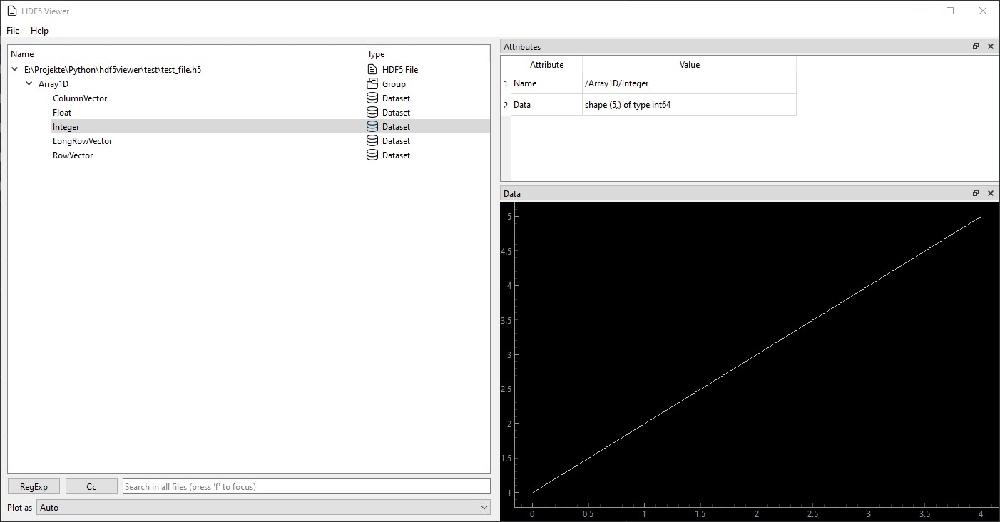

<div align="center">

# HDF5 File Viewer
A Python based file viewer for HDF5 files


</div>


HDF5 Files are developed by the [HDF Group](https://www.hdfgroup.org/solutions/hdf5/).
Each File can contain Groups that work similarly to folders and Datasets that represent raw data.
They are widely used in Industry and Academia to store large sets of raw data.


## 📋 Features
 - Open, or simply Drag&Drop, h5 files to view all groups and datasets
 - Supports remote files on a NAS for example
 - Display datasets as graphs or text
 - Export files to various other file formats
 - Filter list of Datasets by name

Files can be opened either by double-clicking, drag-and-drop or via the File menu.


Right-click on a plot in the bottom right to export the dataset to various other formats, like .csv.


## ▶️ Installation
### Windows & Linux
Windows Installers and Linux executables are listed on the 
[Releases](https://github.com/loenard97/hdf5-viewer/releases) page. Simply download and run the corresponding version. 


### Mac & building binaries from source
The HDF5Viewer should run on Mac, but I can not provide executables, because I do not own a Mac. 
You will have to download the code and use 
```commandline
python3 -m venv venv
source venv/bin/activate
pip install requirements.txt
python main.py
```
to run it directly. Or generate the executable by running `python pyinstaller.py`. This will generate 
the executable in `/dist/main/main`. Use the `windows/compile.iss` script with Inno Setup to generate the Installer for 
Windows.


## 🔗 Acknowledgements and Licenses
The following Python libraries are used in this project:
 - [PyQt6](https://riverbankcomputing.com/commercial/pyqt)
 - [h5py](https://docs.h5py.org/en/stable/licenses.html)
 - [numpy](https://numpy.org/doc/stable/license.html)
 - [natsort](https://github.com/SethMMorton/natsort)
 - [setuptools](https://github.com/pypa/setuptools)
 - [pyqtgraph](https://www.pyqtgraph.org/)
 - [PyInstaller](https://pyinstaller.org/en/stable/license.html)

All icons are part of the *Core Line - Free* Icon-set from [Streamline](https://www.streamlinehq.com/)
and are licensed under a [Link-ware License](https://www.streamlinehq.com/license-freeLinkware).
