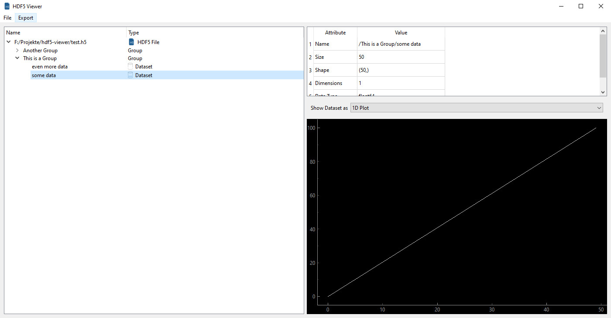

# HDF5 File Viewer
A Python Application to view HDF5 Files.

HDF5 Files are developed by the [HDF5 Group](https://www.hdfgroup.org/solutions/hdf5/).
Each File can contain Groups that work similarly to folders and Datasets that represent raw data.
They are widely used in Academics to store large sets of raw data.

This HDF5 File Viewer can open HDF5 Files and display all Groups and Datasets in the File.
Datasets can be plotted to easily view the data.



This project is a continuous work in progress, so feel free to contact me about any questions 
or suggestions you might have.


## Installation
### Windows
Simply download and execute the HDF5Viewer_Windows_Installer_*version*.exe 
from the [Releases](https://github.com/loenard97/hdf5-viewer/releases) page 
and follow the instructions.

### Debian-like Linux Distros
Download the hdf5viewer_*version*_all.deb package from the 
[Releases](https://github.com/loenard97/hdf5-viewer/releases) page.

Open a Terminal in the Download Folder and install the package with
```commandline
sudo apt install ./hdf5viewer_*version*_all.deb
```
This will install the program in ```/usr/bin/hdf5viewer/hdf5viewer```.
You will have to manually create a desktop shortcut and associate file extensions with the program.
(I couldn't figure out how to do this automatically. Maybe I'll do that in the future.)


### Install from Source
For all other Linux Distros you will have to download the Source Code and build it for yourself.
I suggest creating a Python Virtual Environment:
```commandline
python3 -m venv venv
./venv/bin/python3 -m pip install requirements.txt
./venv/bin/python3 hdf5viewer.py
```


## Acknowledgements and Licenses
The following Python libraries are used in this project:
 - [PyQt6](https://riverbankcomputing.com/commercial/pyqt)
 - [h5py](https://docs.h5py.org/en/stable/licenses.html)
 - [numpy](https://numpy.org/doc/stable/license.html)
 - [pyqtgraph](https://www.pyqtgraph.org/)
 - [PyInstaller](https://pyinstaller.org/en/stable/license.html)
